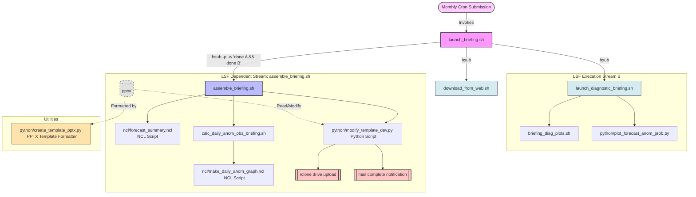

# Program Execution & Workflow

This directory houses the briefing presentation program. The submission script is automated via Cron, managing job dependencies.

## Execution Workflow Map

The diagram below represents the program end-to-end execution.

## Program summary

This program is organized into subdirectories based on script language/templates (`python/`, `ncl/`, `pptx/`). The execution flow is broken into three phases.

### 1. Crontab submission and parallel execution workflow (Tier 1)
*   **`launch_briefing.sh`** — **Crontab submission**. Monthly submission via a `crontab` schedule. Its primary responsibility is to submit the three shell scripts to queue.
*   **`download_from_web.sh` (Job A)** — Handles web downloads and executes simultaneously with Job B.
*   **`launch_diagnostic_briefing.sh` (Job B)** — Runs in parallel with Job A and coordinates information for processing CMCC contribution diagnostics:
    *   **`briefing_diag_plots.sh`** — Handles the variable diagnostic workflow.
    *   **`python/plot_forecast_anom_prob.py`** — Creates the CMCC contribution diagnostic plots.

### 2. Double-dependency (Job A and Job B) execution workflow and final steps (upload, mail - Tier 2)
*   **`assemble_briefing.sh` (Job C)** — Submitted to queue with a dependency on both Job A and Job B: `bsub -p -w 'done(JobA) && done(JobB)'`. It will **only** begin execution once both parallel jobs have completed successfully. It executes the following tasks:
    1.  **`ncl/forecast_summary.ncl`** — Generates the forecast summary image.
    2.  **`calc_daily_anom_obs_briefing.sh`** — Launcher for the **`ncl/make_daily_anom_graph.ncl`** to generate the esacci sst image.
    3.  **`python/modify_template_dev.py`** — Assembles and saves the briefing pptx, replacing image placeholders with the required images created or downloaded earlier in the workflow.
    4.  **`rclone drive upload`** — Pushes the completed briefing pptx presentation to drive.
    5.  **`mail complete notification`** — Mail alert for program completion.

### 3. Briefing pptx templates, and utilities (not run by this program)
*   **`pptx/`** — Houses the briefing presentation templates.
*   **`python/create_template_pptx.py`** — This offline script is used to modify a pptx file saved in Powerpoint/Keynote, converting the images to placeholders. **`python/modify_template_dev.py`** is a dependency.

